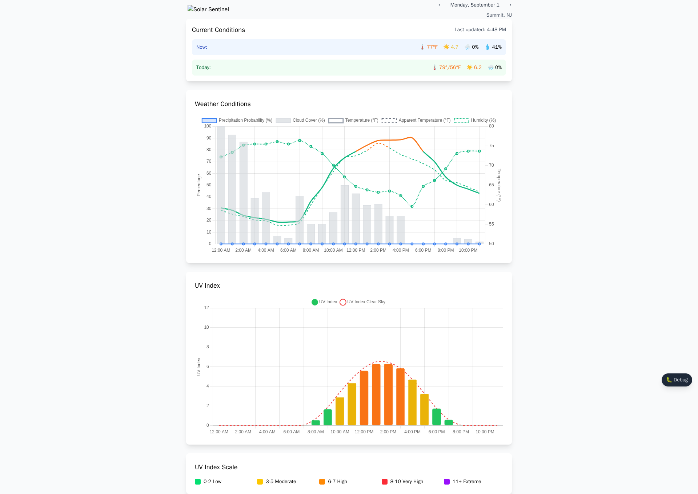
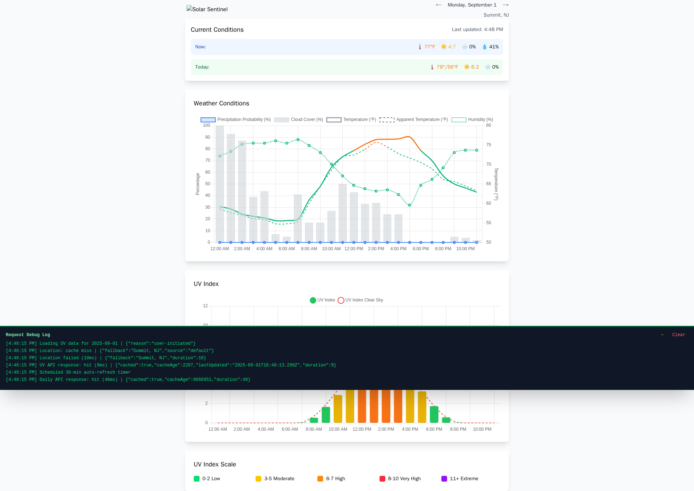
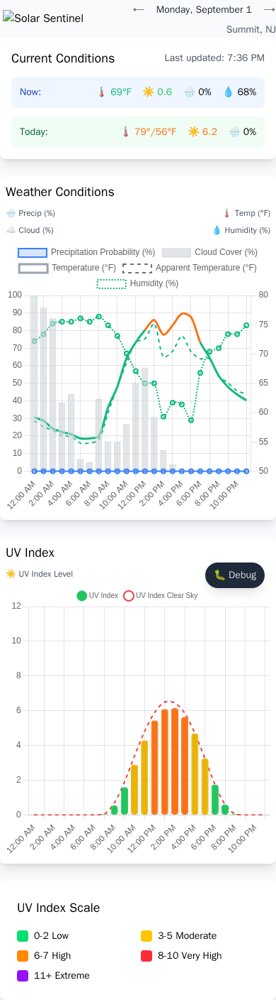
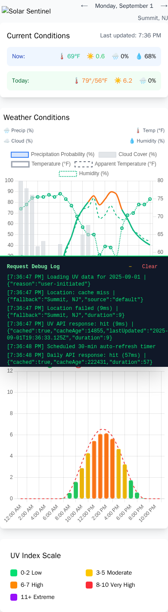

# ☀️ Solar Sentinel

**Real-time UV Index and Weather Monitoring with Instant Location Loading**

Solar Sentinel is a Progressive Web App (PWA) that displays real-time weather data including UV index, temperature, and precipitation probability. Features **instant-loading location caching**, automatic geolocation with reverse geocoding, and comprehensive debugging tools for developers.

## 📸 Screenshots

### 🖥️ Desktop Interface

*Live UV monitoring with location caching, interactive charts, and real-time weather data*

  
*Fixed debug panel showing location cache hits, API timing, and performance metrics*

### 📱 Mobile Experience

*Mobile-optimized responsive design with touch-friendly controls and compact layout*


*Mobile debug panel with optimized spacing and full-width bottom positioning*

## ✨ Features

### 🚀 **Performance & Caching**
- **⚡ Instant Loading** - Location caching eliminates 6+ second geolocation delays 
- **🗄️ Smart Location Cache** - 24-hour localStorage cache with background updates
- **💾 API Caching** - 10-minute location-based cache to reduce API calls
- **🎯 Background Refresh** - Updates location data without blocking UI

### 📊 **Data Visualization** 
- **📈 Interactive UV Chart** - Color-coded UV index bars with danger level indicators
- **🌡️ Weather Chart** - Temperature lines with thermal comfort bands + precipitation areas
- **📋 Smart Conditions Display** - Current hour data (today) or daily forecasts (future days)
- **🎨 Color Coding** - UV levels (green→purple) and temperature zones (blue→red)

### 📍 **Location & Navigation**
- **🗺️ Automatic Geolocation** - Browser-based location detection with reverse geocoding
- **📱 Location Indicator** - 📍 pin shows cached vs default location
- **📅 Date Navigation** - Browse up to 16 days of forecast data
- **🕒 Timezone Aware** - Proper local time handling and date boundaries

### 🔧 **Developer Tools**
- **🐛 Fixed Debug Panel** - Bottom-screen panel with minimize/expand functionality  
- **📊 Performance Metrics** - Real-time API timing, cache status, and location updates
- **⚡ Cache Monitoring** - Visual feedback for cache hits/misses and data age
- **🔍 Request Logging** - Detailed logging of all API calls and responses

### 🎯 **Technical Excellence**
- **📱 Mobile-Optimized** - Responsive design with mobile-specific optimizations
- **🐳 Docker Ready** - Complete containerization with health checks
- **📲 PWA Features** - Installable app with offline support
- **🔒 Security** - Non-root containers, input validation, error handling

## 🚀 Quick Start

### Using Docker (Recommended)

```bash
# Clone the repository
git clone https://github.com/dackerman/solar-sentinel.git
cd solar-sentinel

# Build and run with Docker Compose
docker compose up -d

# Access the app
open http://localhost:9890
```

### Local Development

**Note: This project uses pnpm for package management**

```bash
# Install pnpm (if not already installed)
npm install -g pnpm

# Install dependencies  
pnpm install

# Start development server (with auto-restart)
pnpm run dev

# Or start production server
pnpm start

# Run tests
pnpm test

# Build TypeScript
pnpm run build

# Type checking
pnpm run typecheck

# Format code
pnpm run format
```

## 🛠️ Technology Stack

### **Frontend**
- **TypeScript** - Type-safe JavaScript with ES modules
- **Vite** - Fast build tool and development server  
- **Chart.js** - Interactive data visualization
- **Tailwind CSS** - Utility-first CSS framework
- **PWA APIs** - Service workers, manifest, installable app

### **Backend** 
- **Node.js 20+** - Runtime environment
- **Express.js** - Web framework with ES modules
- **Open-Meteo API** - Weather data source (no API key required)

### **Development & Testing**
- **Vitest** - Unit testing framework
- **Playwright** - End-to-end testing and screenshots
- **Prettier** - Code formatting
- **TypeScript Compiler** - Type checking and transpilation
- **pnpm** - Fast, disk space efficient package manager

### **Infrastructure**
- **Docker** - Containerization with multi-stage builds
- **Docker Compose** - Service orchestration  
- **Health Checks** - Container monitoring and reliability
- **Non-root User** - Security best practices

## 🏗️ Architecture

### Backend (`server.js`)
- **Express.js** server with ES modules (`type: "module"`)
- **Dual API endpoints** - Hourly data (`/api/uv-today`) and daily summaries (`/api/daily-summary`)
- **Open-Meteo API** integration for UV index, precipitation probability, and apparent temperature
- **Location-based caching** - Map keyed by coordinates with 10-minute TTL (separate caches for hourly/daily)
- **Date-aware filtering** - Extracts specific day's hourly data in America/New_York timezone
- **Extended forecast** - Supports up to 16 days of forecast data
- **Coordinate validation** - Validates lat/lon bounds and date ranges
- **Error handling** with comprehensive validation and 502 responses

### Frontend (`public/index.html`)
- **Self-contained HTML** with inline JavaScript and Tailwind CSS via CDN
- **Geolocation API** - Auto-detects user location, falls back to Summit, NJ (40.7162, -74.3625)
- **Current Conditions Display** - Smart card showing current hour (today) or daily forecast (future days)
- **Two Chart.js visualizations**:
  1. Weather chart (color-coded temperature line + precipitation area, dual Y-axis)
  2. UV index bar chart (color-coded by danger level)
- **Temperature Color Coding** - Line segments colored by thermal comfort (blue/green/orange/red)
- **Date navigation** - Arrow controls for browsing forecast days
- **PWA features** - Installable app with offline support
- **Mobile optimizations** - Reduced margins, smaller fonts, rotated labels

### Infrastructure
- **Docker** containerization with Node 20 Alpine
- **Health checks** for container monitoring
- **Non-root user** (`uvapp:1001`) for security
- **Auto-restart** policy for reliability
- **PWA manifest** and service worker for offline capability

## 📍 Location Handling

**Default Location (Summit, NJ):**
- Latitude: `40.7162`
- Longitude: `-74.3625`
- Timezone: `America/New_York`

**Geolocation Features:**
- Browser geolocation API with 5-minute cache
- Reverse geocoding for location names
- Timezone detection heuristic (US longitudes use America/New_York, others use UTC)
- Coordinate validation with lat/lon bounds checking

## 🔧 Configuration

### Environment Variables

| Variable | Default | Description |
|----------|---------|-------------|
| `PORT` | `3000` | Internal server port |
| `NODE_ENV` | `production` | Runtime environment |

### Docker Ports

| Internal | External | Description |
|----------|----------|-------------|
| `3000` | `9890` | Web application |

## 📊 UV Index Scale

The app displays UV values with the following standard scale:

| Range | Level | Color | Protection Needed |
|-------|-------|-------|-------------------|
| 0-2 | Low | 🟢 Green | Minimal |
| 3-5 | Moderate | 🟡 Yellow | Some protection |
| 6-7 | High | 🟠 Orange | Protection required |
| 8-10 | Very High | 🔴 Red | Extra protection |
| 11+ | Extreme | 🟣 Purple | Avoid sun exposure |

## 📅 Date Navigation & Current Conditions

The app supports browsing forecast data for up to 16 days with smart condition display:

- **← Previous Day** - Navigate to earlier forecast data (disabled for past dates)
- **→ Next Day** - Navigate to future forecast data (up to 16 days ahead)
- **Current Date Display** - Shows the selected date (e.g., "Sunday, July 16")
- **Smart Conditions Card**:
  - **Today**: Shows "Current Conditions" with live time and current hour data (feels-like temp, current UV/precip/humidity)
  - **Future Days**: Shows "Daily Forecast" with daily highs/lows (high/low temps, peak UV, max precip/humidity)
- **Timezone Handling** - Properly handles local timezone date boundaries
- **Staleness Indicators** - Shows when current data is from a different hour (e.g., "3:45 PM (showing 3:00 PM)")

## 🛠️ Development

### File Structure

```
solar-sentinel/
├── server.js                    # Express backend
├── src/                         # TypeScript source code
│   ├── app.ts                   # Main application class
│   ├── main.ts                  # Application entry point
│   ├── components/
│   │   └── debug.ts             # Debug panel component
│   ├── services/
│   │   ├── api.ts               # Weather API client
│   │   └── location.ts          # Geolocation & caching service
│   ├── types/
│   │   └── weather.ts           # TypeScript interfaces
│   ├── utils/
│   │   └── charts.ts            # Chart.js utilities
│   └── test/                    # Test files
├── public/                      # Static assets
│   ├── index.html               # Frontend HTML template
│   ├── logo.png                # Application logo
│   ├── manifest.json           # PWA manifest
│   ├── sw.js                   # Service worker
│   └── icons/                  # PWA icons (192px, 512px, etc.)
├── dist/                       # Built assets (generated)
├── screenshots/                # Screenshot generation
│   ├── Dockerfile.screenshot   # Desktop screenshot container
│   ├── Dockerfile.mobile       # Mobile screenshot container
│   ├── screenshot-playwright.js # Desktop capture script
│   └── screenshot-mobile.js    # Mobile capture script  
├── package.json                # Dependencies & scripts
├── tsconfig.json               # TypeScript configuration
├── vitest.config.ts            # Test configuration
├── Dockerfile                  # Production container
├── docker-compose.yml          # Service orchestration
├── AGENTS.md                   # Development guide for AI
└── README.md                   # This file
```

### API Endpoints

- `GET /` - Serves the frontend application
- `GET /api/uv-today` - Returns hourly weather data with optional parameters:
  - `lat` - Latitude (defaults to Summit, NJ)
  - `lon` - Longitude (defaults to Summit, NJ)
  - `date` - Date in YYYY-MM-DD format (defaults to today)
- `GET /api/daily-summary` - Returns daily highs/lows with same parameters
- `GET /api/uv-today/poll` - Polling endpoint for real-time updates

### Response Formats

**Hourly Data (`/api/uv-today`):**
```json
{
  "labels": ["12:00 AM", "1:00 AM", "2:00 AM", ...],
  "uv": [0, 0.1, 4.5, ...],
  "uvClearSky": [0, 0.2, 5.1, ...],
  "precipitation": [0, 5, 20, ...],
  "temperature": [25.3, 26.1, ...],
  "cloudCover": [10, 25, 60, ...],
  "humidity": [65, 70, 80, ...],
  "date": "2025-08-12"
}
```

**Daily Summary (`/api/daily-summary`):**
```json
{
  "date": "2025-08-12",
  "tempMax": 90.5,
  "tempMin": 64.6,
  "uvMax": 7.3,
  "precipMax": 0,
  "humidityMax": 95
}
```

## 🔒 Security Features

- Non-root container user (`uvapp:1001`)
- Read-only filesystem where possible
- Minimal Alpine Linux base image
- No sensitive data exposure
- CORS protection via same-origin policy

## 🌡️ Temperature Color Coding

The temperature line uses thermal comfort bands for quick visual reference:

| Temperature Range | Color | Comfort Level |
|-------------------|-------|---------------|
| ≤32°F | 🔵 Blue | Freezing |
| 32-50°F | 🔵 Light Blue | Cold |
| 50-74°F | 🟢 Green | Mild |
| 74-85°F | 🟠 Orange | Warm |
| 85-95°F | 🔴 Red | Hot |
| ≥95°F | 🔴 Deep Red | Very Hot |

## 📈 Performance

### ⚡ **Location Loading**
- **First visit**: Normal geolocation (~6 seconds) + caching for future
- **Return visits**: **Instant loading** (0ms) from localStorage cache
- **Cache duration**: 24 hours with automatic expiration
- **Background updates**: Fresh location data without blocking UI

### 🎯 **API Performance**  
- **API response**: ~45ms (cached), ~200ms (fresh)
- **Cache strategy**: 10-minute TTL for location-based weather data
- **Request optimization**: Dual endpoints (hourly + daily) with separate caches

### 💻 **Application Metrics**
- **Cold start**: ~2-3 seconds
- **Bundle size**: ~460KB (including optimized logo)  
- **Memory usage**: ~25MB container footprint
- **Chart rendering**: Fixed dimensions, no animations for optimal mobile performance

### 🔧 **Debug Performance**
- **Debug panel**: Fixed positioning, instant toggle, minimize/expand
- **Real-time logging**: Location cache status, API timing, response metrics
- **Performance tracking**: Request duration, cache age, data freshness indicators

## 🧪 Health Monitoring

The application includes comprehensive health checks:

```bash
# Docker health check
docker compose ps

# Manual health check
curl http://localhost:9890/api/uv-today
```

## 📸 Screenshot Generation

Automated UI screenshots are generated using Playwright in Docker for both desktop and mobile views:

```bash
# Generate desktop screenshots (1920x1080)
docker build -f Dockerfile.screenshot -t solar-sentinel-screenshot .
docker run --rm --add-host host.docker.internal:host-gateway \
  -v $(pwd):/screenshots solar-sentinel-screenshot

# Generate mobile screenshots (390x844 - iPhone 13 Pro)  
docker build -f Dockerfile.mobile -t solar-sentinel-mobile .
docker run --rm --add-host host.docker.internal:host-gateway \
  -v $(pwd):/screenshots solar-sentinel-mobile

# Generated files:
# - solar-sentinel-main.png (desktop interface)
# - solar-sentinel-debug.png (desktop with debug panel)
# - solar-sentinel-mobile.png (mobile interface)
# - solar-sentinel-mobile-debug.png (mobile with debug panel)
```

### Screenshot Features
- **Live UI state** with real weather data and current conditions
- **Location caching demonstration** (📍 pin indicates cached user location)
- **Debug panel showcase** (fixed positioning, minimize/expand, real logs)
- **Responsive design verification** (desktop vs mobile layouts)
- **Interactive elements capture** (charts, buttons, navigation controls)
- **Performance metrics display** (cache hits, API timing, data age)

## 🤝 Contributing

1. Fork the repository
2. Create a feature branch: `git checkout -b feature-name`
3. Make your changes
4. Test thoroughly
5. Submit a pull request

## 📝 License

ISC License - see the repository for details.

## 🌐 Data Source

UV data provided by [Open-Meteo](https://open-meteo.com/) - a free, open-source weather API that doesn't require authentication.

---

**Built with ❤️ for weather-conscious users who want to stay sun-safe and informed!**
