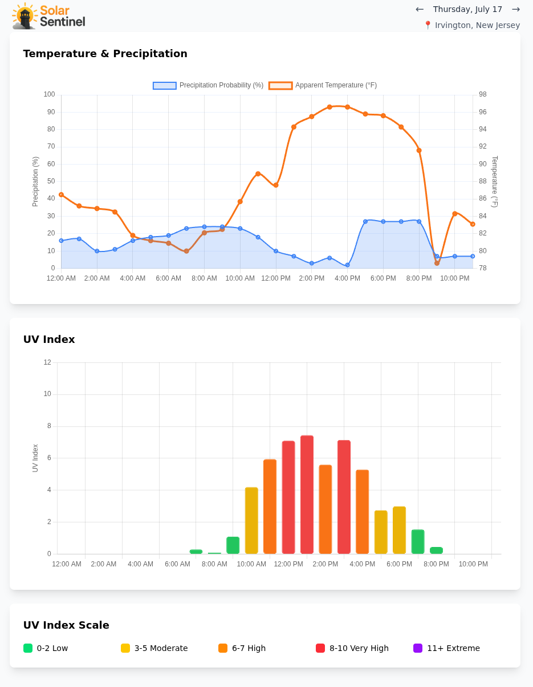

# ☀️ Solar Sentinel

**Real-time UV Index and Weather Monitoring with Location Detection**

Solar Sentinel is a Progressive Web App (PWA) that displays real-time weather data including UV index, temperature, and precipitation probability. Features automatic location detection with fallback to Summit, NJ, and supports up to 16 days of forecast data navigation.



## ✨ Features

- **📊 Dual Interactive Charts** - UV index bar chart and temperature/precipitation line chart using Chart.js
- **📱 Mobile-Optimized** - Responsive design with mobile-specific chart optimizations
- **📍 Location Detection** - Automatic geolocation with reverse geocoding for location names
- **📅 Date Navigation** - Browse up to 16 days of forecast data with arrow controls
- **⚡ Real-time Data** - Fetches weather data from Open-Meteo API
- **💾 Smart Caching** - 10-minute location-based cache to reduce API calls
- **🏥 Health Monitoring** - Built-in health checks and error handling
- **🐳 Docker Ready** - Complete containerization with auto-restart
- **🎨 Modern UI** - Clean interface with Tailwind CSS and custom logo
- **📲 PWA Features** - Installable app with offline support and service worker

## 🚀 Quick Start

### Using Docker (Recommended)

```bash
# Clone the repository
git clone https://github.com/dackerman/solar-sentinel.git
cd solar-sentinel

# Build and run with Docker Compose
docker compose up -d

# Access the app
open http://localhost:9890
```

### Local Development

```bash
# Install dependencies
npm install

# Start development server
npm run dev

# Or start production server
npm start
```

## 🏗️ Architecture

### Backend (`server.js`)
- **Express.js** server with ES modules (`type: "module"`)
- **Open-Meteo API** integration for UV index, precipitation probability, and apparent temperature
- **Location-based caching** - Map keyed by coordinates with 10-minute TTL
- **Date-aware filtering** - Extracts specific day's hourly data in America/New_York timezone
- **Extended forecast** - Supports up to 16 days of forecast data
- **Coordinate validation** - Validates lat/lon bounds and date ranges
- **Error handling** with comprehensive validation and 502 responses

### Frontend (`public/index.html`)
- **Self-contained HTML** with inline JavaScript and Tailwind CSS via CDN
- **Geolocation API** - Auto-detects user location, falls back to Summit, NJ (40.7162, -74.3625)
- **Two Chart.js visualizations**:
  1. Weather chart (temperature line + precipitation area, dual Y-axis)
  2. UV index bar chart (color-coded by danger level)
- **Date navigation** - Arrow controls for browsing forecast days
- **PWA features** - Service worker caching, installable, offline support
- **Mobile optimizations** - Reduced margins, smaller fonts, rotated labels

### Infrastructure
- **Docker** containerization with Node 20 Alpine
- **Health checks** for container monitoring
- **Non-root user** (`uvapp:1001`) for security
- **Auto-restart** policy for reliability
- **PWA manifest** and service worker for offline capability

## 📍 Location Handling

**Default Location (Summit, NJ):**
- Latitude: `40.7162`
- Longitude: `-74.3625`
- Timezone: `America/New_York`

**Geolocation Features:**
- Browser geolocation API with 5-minute cache
- Reverse geocoding for location names
- Timezone detection heuristic (US longitudes use America/New_York, others use UTC)
- Coordinate validation with lat/lon bounds checking

## 🔧 Configuration

### Environment Variables

| Variable | Default | Description |
|----------|---------|-------------|
| `PORT` | `3000` | Internal server port |
| `NODE_ENV` | `production` | Runtime environment |

### Docker Ports

| Internal | External | Description |
|----------|----------|-------------|
| `3000` | `9890` | Web application |

## 📊 UV Index Scale

The app displays UV values with the following standard scale:

| Range | Level | Color | Protection Needed |
|-------|-------|-------|-------------------|
| 0-2 | Low | 🟢 Green | Minimal |
| 3-5 | Moderate | 🟡 Yellow | Some protection |
| 6-7 | High | 🟠 Orange | Protection required |
| 8-10 | Very High | 🔴 Red | Extra protection |
| 11+ | Extreme | 🟣 Purple | Avoid sun exposure |

## 📅 Date Navigation

The app supports browsing forecast data for up to 16 days:

- **← Previous Day** - Navigate to earlier forecast data (disabled for past dates)
- **→ Next Day** - Navigate to future forecast data (up to 16 days ahead)
- **Current Date Display** - Shows the selected date (e.g., "Sunday, July 16")
- **Timezone Handling** - Properly handles local timezone date boundaries

## 🛠️ Development

### File Structure

```
solar-sentinel/
├── server.js              # Express backend
├── public/
│   ├── index.html         # Frontend application
│   ├── logo.png          # Application logo
│   ├── manifest.json     # PWA manifest
│   ├── sw.js            # Service worker
│   ├── icon-192.png     # PWA icon (192x192)
│   └── icon-512.png     # PWA icon (512x512)
├── package.json           # Node.js dependencies
├── Dockerfile             # Container definition
├── docker-compose.yml     # Service orchestration
├── CLAUDE.md             # Development instructions
└── README.md             # This file
```

### API Endpoints

- `GET /` - Serves the frontend application
- `GET /api/uv-today` - Returns weather data with optional parameters:
  - `lat` - Latitude (defaults to Summit, NJ)
  - `lon` - Longitude (defaults to Summit, NJ)
  - `date` - Date in YYYY-MM-DD format (defaults to today)

### Response Format

```json
{
  "labels": ["12:00 AM", "1:00 AM", "2:00 AM", ...],
  "uv": [0, 0.1, 4.5, ...],
  "precipitation": [0, 5, 20, ...],
  "temperature": [25.3, 26.1, ...],
  "date": "2025-07-16"
}
```

## 🔒 Security Features

- Non-root container user (`uvapp:1001`)
- Read-only filesystem where possible
- Minimal Alpine Linux base image
- No sensitive data exposure
- CORS protection via same-origin policy

## 📈 Performance

- **Cold start**: ~2-3 seconds
- **API response**: ~100-200ms (cached)
- **Bundle size**: ~460KB (including optimized logo)
- **Memory usage**: ~25MB container footprint
- **Chart rendering**: Optimized for mobile with fixed dimensions and disabled animations

## 🧪 Health Monitoring

The application includes comprehensive health checks:

```bash
# Docker health check
docker compose ps

# Manual health check
curl http://localhost:9890/api/uv-today
```

## 🤝 Contributing

1. Fork the repository
2. Create a feature branch: `git checkout -b feature-name`
3. Make your changes
4. Test thoroughly
5. Submit a pull request

## 📝 License

ISC License - see the repository for details.

## 🌐 Data Source

UV data provided by [Open-Meteo](https://open-meteo.com/) - a free, open-source weather API that doesn't require authentication.

---

**Built with ❤️ for weather-conscious users who want to stay sun-safe and informed!**